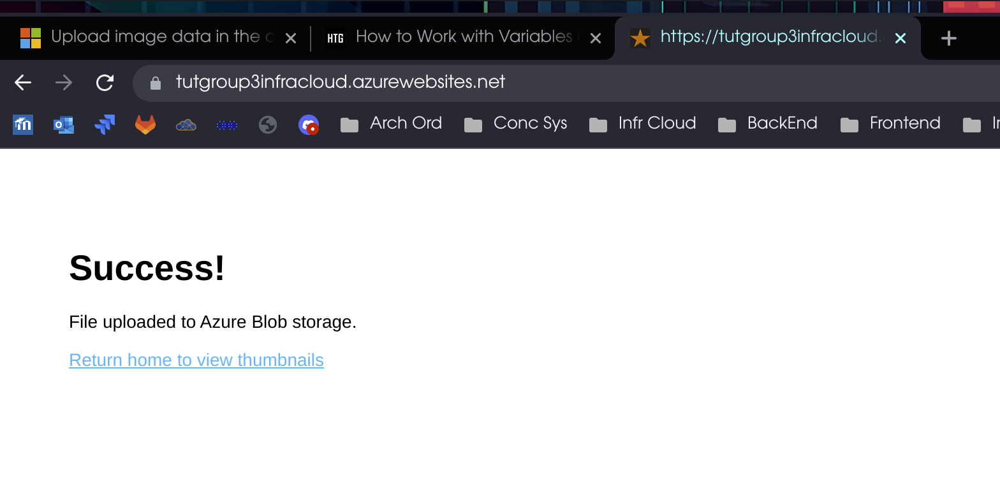

# Données et Stockage

## Etude du cas d'utilisation

 Vignettes could change once generated if we want to support the edit function. Vignettes may have different structures therefore we can not really define a structure. We think the best solution is to use Azure CosmosDB (noSQL) to store the link of the blob file of the images stored with Azure Blob Storage. 


[Tutorial, Part 1: Upload image data in the cloud with Azure Storage](https://learn.microsoft.com/en-us/azure/event-grid/storage-upload-process-images?tabs=javascript%2Cazure-cli)
[Tutorial, Part 2: Automate resizing uploaded images using Event Grid](https://learn.microsoft.com/en-us/azure/event-grid/resize-images-on-storage-blob-upload-event?tabs=dotnet%2Cazure-powershell)

## Create the blob storage on Azure
- our resource group is called *fr-isc-infracloud-tp3-rg*
we want to create a storage account called *blobstoragegroup3* into our resource group

```bash
blobStorageAccount="blobstoragegroup3"
resourceGroup="fr-isc-infracloud-tp3-rg"

az storage account create --name $blobStorageAccount --location switzerlandnorth \
  --resource-group $resourceGroup --sku Standard_LRS --kind StorageV2 --access-tier hot
```

- then get the storage key with: `az storage account keys list` and use it to create 2 containers (one for images and 1 for thumbnails)

```
# create another variable
blobStorageAccountKey=$(az storage account keys list -g $resourceGroup \
  -n $blobStorageAccount --query "[0].value" --output tsv)

az storage container create --name images \
  --account-name $blobStorageAccount \
  --account-key $blobStorageAccountKey

az storage container create --name thumbnails \
  --account-name $blobStorageAccount \
  --account-key $blobStorageAccountKey --public-access container
```

We can find our containers on Azure under our storage group *blobstoragegroup3* -> data storage -> containers

## Create an App service plan

Specify settings of the web server farm that host the app
[App service plan](https://learn.microsoft.com/en-us/azure/app-service/overview-hosting-plans)

```bash
appServicePlanName=group3TutAppServicePlan
az appservice plan create --name $appServicePlanName --resource-group $resourceGroup --sku Free
```

## Create web app

This will create an hosting space for the webapp

```bash
webappNameAndUrlHostname="tutGroup3InfraCloud"
az webapp create --name $webappNameAndUrlHostname --resource-group $resourceGroup --plan $appServicePlanName
```

## Deploy the sample app from the GitHub repository

To deploy the app we set the source as a git repo

```bash
gitrepoapp=https://github.com/Azure-Samples/azure-sdk-for-js-storage-blob-stream-nodejs

az webapp deployment source config --name $webappNameAndUrlHostname --resource-group $resourceGroup \
  --branch master --manual-integration \
  --repo-url $gitrepoapp
```

- Since the app use a [js library](https://github.com/Azure/azure-sdk-for-js/tree/master/sdk/storage) to connect to the storage, it also support a config file added with the cli.

```bash
az webapp config appsettings set --name $webappNameAndUrlHostname --resource-group $resourceGroup \
  --settings AZURE_STORAGE_ACCOUNT_NAME=$blobStorageAccount \
    AZURE_STORAGE_ACCOUNT_ACCESS_KEY=$blobStorageAccountKey
```

- At this point we can test the app by adding an image, the app url is at https://<webappNameAndUrlHostname>.azurewebsites.net




## Create an Azure Storage account

This create a storage account that will store our function app

```bash
resourceGroup="fr-isc-infracloud-tp3-rg"
location="switzerlandnorth"
functionstorage="functstoragetutp2"
az storage account create --name $functionstorage --location $location --resource-group $resourceGroup --sku Standard_LRS --kind StorageV2
```

## Create a function app

```bash
functionapp="funcapptutp2"
az functionapp create --name $functionapp --storage-account $functionstorage --resource-group $resourceGroup --consumption-plan-location $location --functions-version 3
```

## Configure the function app

gives credential for the function to connect to the blobstorage

```bash

blobStorageAccountKey=$(az storage account keys list -g $resourceGroup -n $blobStorageAccount --query [0].value --output tsv)
storageConnectionString=$(az storage account show-connection-string --resource-group $resourceGroup --name $blobStorageAccount --query connectionString --output tsv)

az functionapp config appsettings set --name $functionapp --resource-group $resourceGroup --settings FUNCTIONS_EXTENSION_VERSION=~2 BLOB_CONTAINER_NAME=thumbnails AZURE_STORAGE_ACCOUNT_NAME=$blobStorageAccount AZURE_STORAGE_ACCOUNT_ACCESS_KEY=$blobStorageAccountKey AZURE_STORAGE_CONNECTION_STRING=$storageConnectionString FUNCTIONS_WORKER_RUNTIME=node WEBSITE_NODE_DEFAULT_VERSION=~10

```

## Deploy the function code

now we can deploy the function app

```bash
az functionapp deployment source config --name $functionapp \
  --resource-group $resourceGroup --branch master --manual-integration \
  --repo-url https://github.com/Azure-Samples/storage-blob-resize-function-node
```

## Create an event subscription

This is done in the Azure portal

## Test the app

The working app is online at:

[url app](https://tutgroup3infracloud.azurewebsites.net)

## Questions, critères du tp

1) Un cas d'utilisation ayant besoin de stockage d'image est présenté /1

We want to implement an social events/people tracking system, where an event is a party, festival, meeting, ecc. This avents are linked to 1 or more geograpic positions (I.E. coordinates). Peoples can share theyr participation/position and also share photos at the event. People can also interact with each other.

2) Les données sont caractérisées de façon cohérente pour le cas d'utilisation /3

Our data is non-structured (or lightly structured). And our data is static because people could update theyr status often.
Images have a a lot of meta data. People are position tracked.

3) Les paramètres choisis pour le Blob Storage sont justifiés et cohérents avec le cas d'utilisation /3

TODO

4) Quel service d'Azure correspond le mieux à votre cas? (pas nécessairement Blob Storage) /1

The best solution would be to use a CosmoDB. Or CosmosDB + BlobStorage for the images


5) Vous présentez un plan d'évolution de votre service, et le coût en stockage attendu /2

TODO

6) Votre service d'image est accessible, avec au moins une image stockée sur Azure Blob Storage /3

https://tutgroup3infracloud.azurewebsites.net